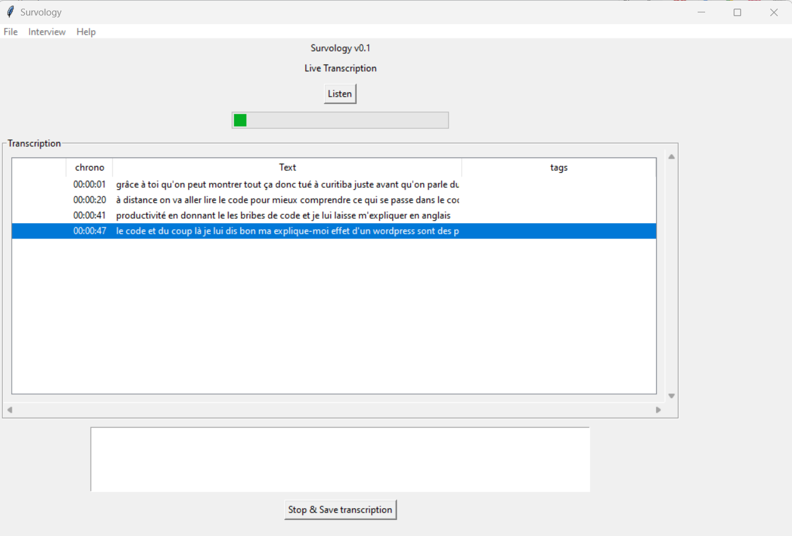

SURVOLOGY
---

# Installation

# Run

# Features
## Live transcription

## Transcription editing with audio files

# Release Notes

# todo 
* installer
  * https://stackoverflow.com/questions/9960583/how-do-you-make-an-installer-for-your-python-program
  * select vosk dictionnaries
  * install vosk dictionnaries in ./vosk
  * select "audio samples" location & create dir
  * install ffmpeg (adapt to platform)
* strengthen transcription
  * try conflicting vosk w/ google & others to highlight mistranscriptions
* transcription analysis
  * http://www.xavierdupre.fr/app/ensae_teaching_cs/helpsphinx/notebooks/td2a_eco_NLP_tf_idf_ngrams_LDA_word2vec_sur_des_extraits_litteraires.html

